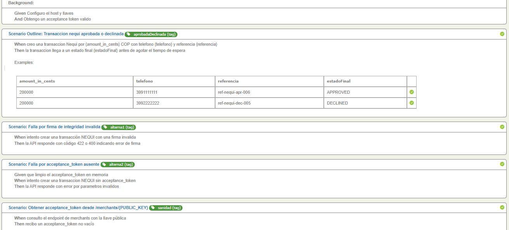

#  Reto de Automatización - Wompi (Nequi)

Este proyecto contiene la automatización de pruebas para la pasarela de
pagos **Wompi**, utilizando el medio de pago **Nequi**.
Se implementó en **Java**, con el patrón **Screenplay de Serenity BDD**
y **Cucumber** para la definición de escenarios en Gherkin.

------------------------------------------------------------------------

##  Clonar el repositorio

Para descargar el proyecto en tu máquina local:

```bash
# Ubícate en la carpeta donde quieras guardar el proyecto
cd C:\Users\....

# Clona el repositorio
git clone https://github.com/Julian981309/Reto_Wompi.git

# Ingresa a la carpeta del proyecto
cd Reto_Wompi

------------------------------------------------------------------------

##  Estructura de pruebas

Los escenarios cubren tanto **flujos exitosos** como **flujos
alternos**:

1.  **Transacción Nequi aprobada o declinada**
    -   amount_in_cents=200000, teléfono=3991111111 →
        estadoFinal=APPROVED
    -   amount_in_cents=200000, teléfono=3992222222 →
        estadoFinal=DECLINED
2.  **Falla por firma de integridad inválida**
    -   La API responde con error `422` o `400`.
3.  **Falla por `acceptance_token` ausente**
    -   La API responde con error por parámetros inválidos.
4.  **Obtención de `acceptance_token` válido**
    -   Desde el endpoint `/merchants/{PUBLIC_KEY}`.

------------------------------------------------------------------------

##  Ejecución de pruebas

Para ejecutar los escenarios:

``` bash
mvn clean verify
```

Este comando: 
- Compila el proyecto
- Ejecuta los escenarios definidos en Cucumber
- Genera los reportes de Serenity BDD y Cucumber

------------------------------------------------------------------------

##  Reportes

Una vez finalizada la ejecución, los reportes estarán disponibles en:

-   **Reporte Serenity BDD (principal):**
    `target/site/serenity/index.html`

-   **Reporte Cucumber (alterno):**
    `target/cucumber-reports.html`

Los reportes incluyen métricas como: 
- Casos pasados / fallidos / ignorados
- Duración de cada escenario
- Evidencia paso a paso de cada ejecución

------------------------------------------------------------------------

##  Resultados de la última ejecución

Según los reportes, se ejecutaron **5 escenarios automatizados** y todos
finalizaron con **estado exitoso (100%)**:

-   2 transacciones Nequi (aprobada y declinada)
-   2 escenarios alternos (firma inválida y token ausente)
-   1 escenario de sanidad (obtención de `acceptance_token`)

------------------------------------------------------------------------

##  Conclusiones

-   La automatización valida correctamente **el ciclo de vida de una
    transacción en Wompi con Nequi**.
-   El patrón **Screenplay** permitió una estructura clara y
    reutilizable en las tareas.
-   **Serenity BDD** entregó reportes detallados que facilitan el
    análisis de resultados.
-   Se cubrieron tanto los **flujos exitosos** como los **flujos
    alternos**, garantizando robustez en las validaciones.
-   La ejecución fue exitosa con un **100% de pruebas aprobadas** en la
    última corrida.

------------------------------------------------------------------------

## Reportes de ejecución




